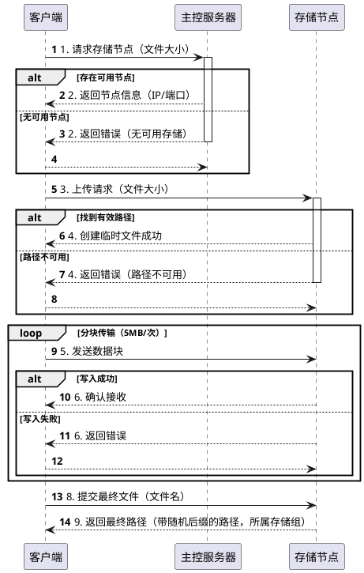

1. client 向 master 请求一个有效的 storage，请求 payload 为文件大小
2. master 服务器收到请求后，以循环赛的方式从当前已注册的 storage 中拿到一个有效的，并返回给 client；如果没有有效的，则返回错误
3. client 收到服务器的响应后，如果 storage 有效，则连接 storage，并发送上传文件请求，请求 payload 为文件大小
4. stroage 收到上传文件请求后，以循环赛的方式从所有的热数据路径中找到一个有效的路径，创建一个临时文件，并返回成功响应；如果失败，则返回错误
5. client 收到成功响应后，分块依次发送文件内容（块大小通常为 5MB）
6. storage 收到块消息后，写入文件，并响应成功；如果失败，则返回失败
7. 循环 5 和 6 直到 client 上传所有文件块
8. client 向 storage 发送上传结束请求，且 payload 为文件名
9. storage 收到请求后，重命名临时文件，并在文件名后添加随机 8 长度的字符串，然后返回文件的相对路径和 storage 所属 group，client 此后可以通过该相对路径操作文件

